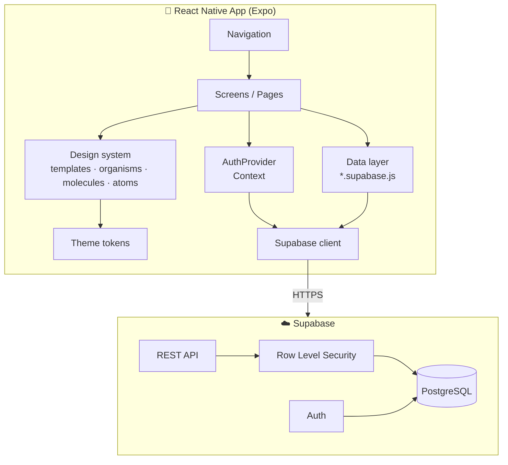
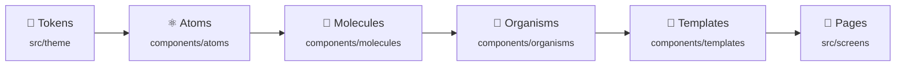

<div align="center">


# ComuniApp

**A mobile app for organizing communities: groups, events and attendance in one place.**

[](https://reactnative.dev/)
[](https://expo.dev/)
[](https://supabase.com/)
[](https://www.postgresql.org/)


[Overview](#-overview) •
[Features](#-features) •
[Tech Stack](#-tech-stack) •
[Architecture](#-architecture) •
[Design System](#-frontend-architecture-atomic-design) •
[Getting Started](#-getting-started) •
[Project Structure](#-project-structure) •
[Technical Decisions](#-technical-decisions)

</div>

---

## 📖 Overview

**ComuniApp** helps communities such as neighborhoods, churches, associations and sports clubs stay organized. Announcements, events and attendance tracking live in a single app instead of being scattered across WhatsApp, Facebook and email.

### The problem

| Pain point | What happens today |
| --- | --- |
| 🧩 **Scattered information** | Announcements on WhatsApp, events on Facebook, files on Drive |
| 💬 **Lost messages** | Important updates get buried in busy group chats |
| 📋 **Messy event management** | Hard to track who is actually attending |
| 🧭 **No single source of truth** | Members don't know where to look |

### The solution

ComuniApp gives every community one place to publish events, manage members and confirm attendance from any phone.

---

## ✨ Features

<table>
<tr>
<td valign="top" width="50%">

### 👤 Members

- 🔐 **Secure authentication** with email verification and password recovery
- 👥 **Groups**: join existing groups or create your own
- 📅 **Events**: browse upcoming events and RSVP
- 🔔 **In-app notifications** with a personal inbox and read/unread status
- 🔍 **Explore** groups and events in your community
- 🪪 **Editable profile**

</td>
<td valign="top" width="50%">

### 🛡️ Owners & Admins

- ➕ **Create events** with date, time and location
- ✅ **Approve requests** to join groups and attend events
- 📊 **Attendee list** for every event
- 🗑️ **Delete** events and groups, enforced by RLS policies
- 🧑‍🤝‍🧑 **Role-based permissions** (owner / admin / member)

</td>
</tr>
</table>

---

## 🛠️ Tech Stack

| Layer | Technology |
| --- | --- |
| 📱 **Mobile** | [React Native](https://reactnative.dev/) 0.81 · [Expo](https://expo.dev/) SDK 54 · React 19 |
| 🧭 **Navigation** | [React Navigation](https://reactnavigation.org/) 7 (native stack + bottom tabs) |
| 🎨 **UI** | Custom design system (Atomic Design + theme tokens) · [Ionicons](https://icons.expo.fyi/) |
| ☁️ **Backend** | [Supabase](https://supabase.com/): Auth, auto-generated REST API, Row Level Security |
| 🗄️ **Database** | PostgreSQL |
| 💾 **Session storage** | AsyncStorage (native) / localStorage (web) |

---

## 🏗️ Architecture



- **Screens** are composed from the **design system** (`src/components`) and fetch data through the **data layer** (`src/data/*.supabase.js`). The profile screens still read the `profiles` table directly.
- **AuthProvider** exposes the session and auth actions (`signIn`, `signUp`, `resetPassword`, …) through React Context.
- **Authorization lives in the database**: RLS policies decide who can read, create or delete each row.

> 🧩 The UI layer is built as an **Atomic Design** system. See [Frontend Architecture](#-frontend-architecture-atomic-design) for the full breakdown.

### 🔔 Notifications with Supabase

The **Notifications** tab combines two feeds, both served by Supabase:

| Feed | Source | Who sees it | Actions |
| --- | --- | --- | --- |
| 🛡️ **Admin requests** | Rows with `status = 'PENDING'` in `group_join_requests` and `events`, limited to groups where the user is owner/admin | Owners & admins | ✅ Approve / ❌ Reject directly from the list |
| 📥 **Personal inbox** | `notifications` table (`user_id`, `read`, `created_at`, …) | Each user, only their own rows | Mark one or all as read |

How it works:

1. **Requests become notifications automatically.** When a member asks to join a group or proposes an event, the row is stored as `PENDING`. The admin feed is a query over those pending rows, so no extra table is needed.
2. **Approving or rejecting updates the source row.** For example, approving a join request inserts the user into `group_members` with the `MEMBER` role.
3. **The personal inbox relies on RLS.** The app queries `notifications` without filtering by user; Row Level Security makes sure each user only gets their own rows. The client only reads them and sets `read = true`. It never creates them.
4. **Refresh is on demand.** The list loads when the screen opens and on pull-to-refresh.

> [!NOTE]
> These are in-app notifications. Push notifications (`expo-notifications`) and live updates (Supabase Realtime) are not implemented yet.

---

## 🧩 Frontend Architecture: Atomic Design

The interface is a small in-house design system organized with [Atomic Design](https://atomicdesign.bradfrost.com/chapter-2/). Screens no longer style anything themselves: they **compose components**, and components **read every visual value from theme tokens**.



### Layers

| Level | What lives here | Components |
| --- | --- | --- |
| 🎨 **Tokens** | Design decisions as data. The only place with raw values | `colors` · `spacing` · `typography` · `radius` · `shadows` · `sizes` |
| ⚛️ **Atoms** | Smallest UI pieces. No business logic, no data fetching | `AppText` · `Button` · `IconButton` · `Input` · `Icon` · `Avatar` · `Badge` · `Card` · `Skeleton` |
| 🧬 **Molecules** | A few atoms with one job | `FormField` · `PasswordField` · `SearchBar` · `InfoRow` · `ListItem` · `SectionHeader` · `SegmentedControl` · `EmptyState` · `ErrorState` |
| 🦠 **Organisms** | Complete, reusable sections of a screen | `AppHeader` · `EventCard` · `RequestItem` · `NotificationItem` · `GroupListItem` · `ProfileHeader` · `DateTimeField` · `Fab` |
| 📐 **Templates** | Page skeletons: layout only, no data | `Screen` · `AuthTemplate` |
| 📱 **Pages** | Screens: load data, handle actions and fill a template | `src/screens/{auth,events,groups,notifications,profile}` |

Cross-cutting UI services live next to the system:

| Folder | Purpose |
| --- | --- |
| `src/feedback` | `ToastProvider` / `useToast()` for non-blocking messages and `confirm()` for destructive actions (works on iOS, Android **and web**) |
| `src/utils` | Shared date formatting (`formatEventLong`, `timeAgo`, …) |

### Dependency rules

```
pages ──▶ templates ──▶ organisms ──▶ molecules ──▶ atoms ──▶ theme
```

1. **Imports only point downwards.** An atom never imports a molecule; a molecule never imports an organism.
2. **No raw style values outside `src/theme`.** Colors, font sizes and spacing always come from tokens.
3. **Components don't fetch data.** Only pages call `src/data/*`; components receive data and callbacks through props.
4. **One icon family.** Everything uses Ionicons through the `Icon` atom.
5. **Pages import from one place:** `import { Screen, Button, EventCard } from '../../components'`.

### Design tokens

<table>
<tr>
<td valign="top">

**Color roles**

| Token | Use |
| --- | --- |
| `primary` | Brand, primary actions |
| `primarySoft` | Selected and secondary backgrounds |
| `textPrimary` | Titles and main text |
| `textSecondary` | Supporting text |
| `textMuted` | Placeholders and hints |
| `border` | Inputs, cards, dividers |
| `danger` / `success` | Errors / confirmations |

</td>
<td valign="top">

**Type scale**

| Variant | Size |
| --- | --- |
| `display` | 28 |
| `title` | 22 |
| `heading` | 18 |
| `body` | 16 |
| `label` | 14 |
| `caption` | 13 |

</td>
<td valign="top">

**Spacing (4-pt)**

| Token | px |
| --- | --- |
| `xs` | 4 |
| `sm` | 8 |
| `md` | 12 |
| `lg` | 16 |
| `xl` | 24 |
| `xxl` | 32 |

</td>
</tr>
</table>

Components use **semantic roles** (`textSecondary`, `danger`) rather than palette values (`gray500`, `red500`). Switching the palette or adding a dark theme only touches `src/theme/colors.js`.

### Example: a page built from the system

```jsx
// src/screens/groups/CreateGroupScreen.js (simplified)
import { Screen, AppText, Button, FormField } from '../../components';
import { useToast } from '../../feedback';

export default function CreateGroupScreen() {
    const toast = useToast();
    // ...state and createGroup() call

    return (
        <Screen keyboard footer={<Button title="Crear grupo" onPress={onCreate} loading={loading} />}>
            <AppText tone="secondary">Serás el owner del grupo…</AppText>
            <FormField label="Nombre del grupo" value={name} onChangeText={setName} error={error} />
            <FormField label="Descripción (opcional)" multiline value={desc} onChangeText={setDesc} />
        </Screen>
    );
}
```

The page has **no `StyleSheet` for visuals**. Safe area, keyboard avoidance, scrolling, the sticky footer, input focus and error styles all come from the system.

### UX conventions built in

| Convention | How the system enforces it |
| --- | --- |
| ✅ **Inline validation** | `FormField` shows the error under the field and highlights the border |
| 🔔 **Non-blocking feedback** | `useToast()` for success and errors; `confirm()` only for destructive actions |
| ⏳ **Loading states** | `Button loading`, plus `Skeleton` / `EventCardSkeleton` shaped like the real content |
| 🫙 **Empty & error states** | `EmptyState` and `ErrorState` with an optional action |
| ♿ **Accessibility** | Every `IconButton` gets an `accessibilityLabel`; 44 pt minimum touch targets; roles and live regions on buttons, headers and errors |
| 📱 **Safe areas** | `Screen`, `AppHeader`, `Fab` and toasts respect notches and home indicators |
| 🌐 **Cross-platform** | `confirm()` and `DateTimeField` have native and web implementations |

### Adding a component

1. Pick the **lowest level** that fits (prefer an atom or molecule over a new organism).
2. Create it in `src/components/<level>/` using only tokens from `src/theme` and components from lower levels.
3. Export it from that level's `index.js`.
4. Use it from pages through `import { MyComponent } from '../../components'`.

---

## 🚀 Getting Started

### Prerequisites

- [Node.js](https://nodejs.org/) 18+
- A free [Supabase](https://supabase.com/) project
- [Expo Go](https://expo.dev/go) on your phone, or an iOS/Android simulator

### 1. Clone and install

```bash
git clone https://github.com/JesusAbarcaRodriguez/ComuniApp.git
cd ComuniApp/comuniApp
npm install
```

### 2. Configure environment variables

```bash
cp -n .env.example .env
```

Fill in the values from **Supabase Dashboard → Project Settings → API Keys**:

```env
EXPO_PUBLIC_SUPABASE_URL=https://<project-id>.supabase.co
EXPO_PUBLIC_SUPABASE_ANON_KEY=<publishable or anon key>

# Optional: where the password-reset email redirects to.
# If empty, Supabase uses the Site URL configured in the dashboard.
EXPO_PUBLIC_PASSWORD_RESET_REDIRECT_URL=
```

> [!WARNING]
> Only use the **publishable / anon** key. Never put the `service_role` or secret key in the app.

### 3. Set up the database

Create the following tables in the Supabase **SQL Editor**:

| Table | Purpose |
| --- | --- |
| `profiles` | User profile data |
| `groups` | Community groups |
| `group_members` | Group membership and roles |
| `group_join_requests` | Pending requests to join a group |
| `events` | Community events |
| `event_attendees` | Event RSVPs |
| `notifications` | Per-user in-app notifications (`user_id`, `read`, `created_at`) |

Then run [`supabase/delete_policies.sql`](./supabase/delete_policies.sql) to enable the delete policies. See [`docs/delete-policies.md`](./docs/delete-policies.md) for details.

### 4. Run the app

```bash
npx expo start --clear
```

| Key | Target |
| --- | --- |
| `a` | 🤖 Android emulator / device |
| `i` | 🍎 iOS simulator |
| `w` | 🌐 Web browser |

Or scan the QR code with **Expo Go**.

> [!TIP]
> Having trouble running on an iPhone with Expo Go? See [`docs/ios-expo-go.md`](./docs/ios-expo-go.md).

---

## 📱 Usage

**As a member**

1. Sign up with your email and confirm it (check your spam folder).
2. Join an existing group or create a new one.
3. Browse upcoming events and confirm your attendance.

**As an owner/admin**

1. Create a group from your profile.
2. Publish events with date, time and location.
3. Review and approve join and attendance requests.

---

## 📂 Project Structure

```
ComuniApp/
├── comuniApp/                     # Expo application
│   ├── App.js                     # Providers: SafeArea, Auth, Toast, Navigation theme
│   ├── src/
│   │   ├── theme/                 # Design tokens: colors, spacing, typography, radius, shadows
│   │   ├── components/            # Design system (Atomic Design)
│   │   │   ├── atoms/             # AppText, Button, IconButton, Input, Icon, Avatar, Badge, Card, Skeleton
│   │   │   ├── molecules/         # FormField, PasswordField, SearchBar, InfoRow, ListItem, SectionHeader, EmptyState…
│   │   │   ├── organisms/         # AppHeader, EventCard, RequestItem, NotificationItem, GroupListItem, DateTimeField, Fab…
│   │   │   └── templates/         # Screen, AuthTemplate (page layouts)
│   │   ├── screens/               # Pages, grouped by feature
│   │   │   ├── auth/              # Sign in, sign up, forgot password
│   │   │   ├── events/            # Explore, details, create, approval and attendance requests
│   │   │   ├── groups/            # Select, create, join requests
│   │   │   ├── notifications/
│   │   │   └── profile/           # Profile, edit profile
│   │   ├── feedback/              # Toast provider + cross-platform confirm dialog
│   │   ├── navigation/            # RootNavigator (stack + bottom tabs)
│   │   ├── context/               # AuthProvider (session + auth actions)
│   │   ├── data/                  # Data access: events, groups, notifications, requests
│   │   ├── lib/                   # Supabase client
│   │   ├── utils/                 # Date formatting helpers
│   │   └── assets/                # Logo
│   ├── .env.example               # Environment variable template
│   ├── app.json                   # Expo config
│   └── package.json
├── supabase/
│   └── delete_policies.sql        # RLS policies for deleting events and groups
├── docs/                          # Setup guides and troubleshooting
└── README.md
```

---

## 🧠 Technical Decisions

<details open>
<summary><b>📱 Mobile app instead of a web app (React Native + Expo)</b></summary>

<br/>

Most community members use their phones. Expo provides a single codebase for iOS and Android, fast refresh, painless testing on real devices with Expo Go, and cloud builds with EAS, all without touching native configuration.

</details>

<details open>
<summary><b>🟢 Supabase instead of Firebase</b></summary>

<br/>

The data is relational: users belong to groups, groups have events, and events have attendees. PostgreSQL models this naturally and supports real SQL queries. Supabase adds built-in auth, an auto-generated REST API and **Row Level Security**, so permission rules live next to the data. It is also open source and has a generous free tier.

</details>

<details open>
<summary><b>🧩 Atomic Design system instead of per-screen styles</b></summary>

<br/>

Each screen used to define its own colors, sizes and buttons, so the UI drifted: 11 different font sizes, 66 native alerts and duplicated request cards across 4 screens. A token-based Atomic Design system makes consistency the default, keeps screens focused on data and behavior, and lets a visual change (or a future dark mode) happen in one place.

</details>

<details open>
<summary><b>🧱 No custom backend (no Node.js / Express)</b></summary>

<br/>

Supabase exposes the database through an auto-generated API protected by RLS. That removes a whole server to build, deploy and secure, which means less code, a smaller attack surface and lower infrastructure costs.

</details>

---

## 🤝 Contributing

Contributions are welcome!

1. Fork the repository
2. Create a branch: `git checkout -b feature/my-feature`
3. Commit your changes: `git commit -m "Add my feature"`
4. Push the branch: `git push origin feature/my-feature`
5. Open a Pull Request

Please follow the existing folder structure and test on both iOS and Android before opening a PR.

---

## 👥 Authors

<table>
<tr>
<td align="center">
<a href="https://github.com/JesusAbarcaRodriguez">
<br/>
<b>Jesus Abarca</b>
</a>
</td>
<td align="center">
<a href="https://github.com/Francisco-Amador">
<br/>
<b>Francisco Amador</b>
</a>
</td>
</tr>
</table>

---

## 📄 License

This project is open source and was built for educational purposes.

---

<div align="center">

Have a question or idea? [Open an issue](https://github.com/JesusAbarcaRodriguez/ComuniApp/issues).

⭐ **If you find this project useful, consider giving it a star!**

</div>
