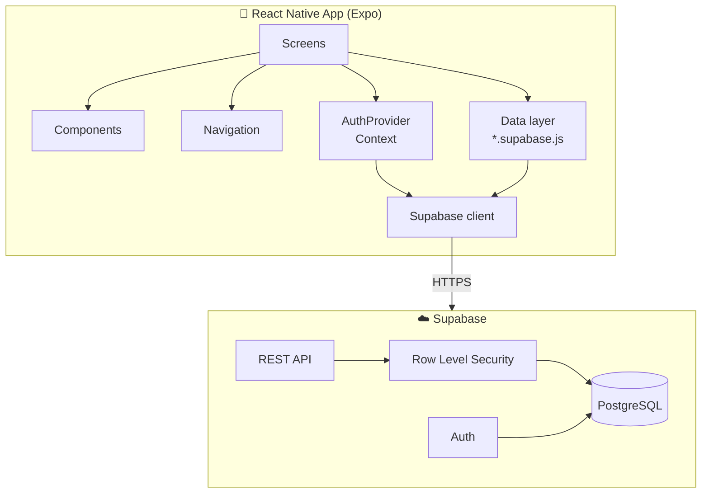

<div align="center">


# ComuniApp

**A mobile app for organizing communities: groups, events and attendance in one place.**

[](https://reactnative.dev/)
[](https://expo.dev/)
[](https://supabase.com/)
[](https://www.postgresql.org/)


[Overview](#-overview) •
[Features](#-features) •
[Tech Stack](#-tech-stack) •
[Architecture](#-architecture) •
[Getting Started](#-getting-started) •
[Project Structure](#-project-structure) •
[Technical Decisions](#-technical-decisions)

</div>

---

## 📖 Overview

**ComuniApp** helps communities such as neighborhoods, churches, associations and sports clubs stay organized. Announcements, events and attendance tracking live in a single app instead of being scattered across WhatsApp, Facebook and email.

### The problem

| Pain point | What happens today |
| --- | --- |
| 🧩 **Scattered information** | Announcements on WhatsApp, events on Facebook, files on Drive |
| 💬 **Lost messages** | Important updates get buried in busy group chats |
| 📋 **Messy event management** | Hard to track who is actually attending |
| 🧭 **No single source of truth** | Members don't know where to look |

### The solution

ComuniApp gives every community one place to publish events, manage members and confirm attendance from any phone.

---

## ✨ Features

<table>
<tr>
<td valign="top" width="50%">

### 👤 Members

- 🔐 **Secure authentication** with email verification and password recovery
- 👥 **Groups**: join existing groups or create your own
- 📅 **Events**: browse upcoming events and RSVP
- 🔔 **In-app notifications** with a personal inbox and read/unread status
- 🔍 **Explore** groups and events in your community
- 🪪 **Editable profile**

</td>
<td valign="top" width="50%">

### 🛡️ Owners & Admins

- ➕ **Create events** with date, time and location
- ✅ **Approve requests** to join groups and attend events
- 📊 **Attendee list** for every event
- 🗑️ **Delete** events and groups, enforced by RLS policies
- 🧑‍🤝‍🧑 **Role-based permissions** (owner / admin / member)

</td>
</tr>
</table>

---

## 🛠️ Tech Stack

| Layer | Technology |
| --- | --- |
| 📱 **Mobile** | [React Native](https://reactnative.dev/) 0.81 · [Expo](https://expo.dev/) SDK 54 · React 19 |
| 🧭 **Navigation** | [React Navigation](https://reactnavigation.org/) 7 (native stack + bottom tabs) |
| 🎨 **UI** | [@expo/vector-icons](https://icons.expo.fyi/) · custom animated components |
| ☁️ **Backend** | [Supabase](https://supabase.com/): Auth, auto-generated REST API, Row Level Security |
| 🗄️ **Database** | PostgreSQL |
| 💾 **Session storage** | AsyncStorage (native) / localStorage (web) |

---

## 🏗️ Architecture



- **Screens** only talk to the **data layer** (`src/data/*.supabase.js`), never to Supabase directly.
- **AuthProvider** exposes the session and auth actions (`signIn`, `signUp`, `resetPassword`, …) through React Context.
- **Authorization lives in the database**: RLS policies decide who can read, create or delete each row.

### 🔔 Notifications with Supabase

The **Notifications** tab combines two feeds, both served by Supabase:

| Feed | Source | Who sees it | Actions |
| --- | --- | --- | --- |
| 🛡️ **Admin requests** | Rows with `status = 'PENDING'` in `group_join_requests` and `events`, limited to groups where the user is owner/admin | Owners & admins | ✅ Approve / ❌ Reject directly from the list |
| 📥 **Personal inbox** | `notifications` table (`user_id`, `read`, `created_at`, …) | Each user, only their own rows | Mark one or all as read |

How it works:

1. **Requests become notifications automatically.** When a member asks to join a group or proposes an event, the row is stored as `PENDING`. The admin feed is a query over those pending rows, so no extra table is needed.
2. **Approving or rejecting updates the source row.** For example, approving a join request inserts the user into `group_members` with the `MEMBER` role.
3. **The personal inbox relies on RLS.** The app queries `notifications` without filtering by user; Row Level Security makes sure each user only gets their own rows. The client only reads them and sets `read = true`. It never creates them.
4. **Refresh is on demand.** The list loads when the screen opens and on pull-to-refresh.

> [!NOTE]
> These are in-app notifications. Push notifications (`expo-notifications`) and live updates (Supabase Realtime) are not implemented yet.

---

## 🚀 Getting Started

### Prerequisites

- [Node.js](https://nodejs.org/) 18+
- A free [Supabase](https://supabase.com/) project
- [Expo Go](https://expo.dev/go) on your phone, or an iOS/Android simulator

### 1. Clone and install

```bash
git clone https://github.com/JesusAbarcaRodriguez/ComuniApp.git
cd ComuniApp/comuniApp
npm install
```

### 2. Configure environment variables

```bash
cp -n .env.example .env
```

Fill in the values from **Supabase Dashboard → Project Settings → API Keys**:

```env
EXPO_PUBLIC_SUPABASE_URL=https://<project-id>.supabase.co
EXPO_PUBLIC_SUPABASE_ANON_KEY=<publishable or anon key>

# Optional: where the password-reset email redirects to.
# If empty, Supabase uses the Site URL configured in the dashboard.
EXPO_PUBLIC_PASSWORD_RESET_REDIRECT_URL=
```

> [!WARNING]
> Only use the **publishable / anon** key. Never put the `service_role` or secret key in the app.

### 3. Set up the database

Create the following tables in the Supabase **SQL Editor**:

| Table | Purpose |
| --- | --- |
| `profiles` | User profile data |
| `groups` | Community groups |
| `group_members` | Group membership and roles |
| `group_join_requests` | Pending requests to join a group |
| `events` | Community events |
| `event_attendees` | Event RSVPs |
| `notifications` | Per-user in-app notifications (`user_id`, `read`, `created_at`) |

Then run [`supabase/delete_policies.sql`](./supabase/delete_policies.sql) to enable the delete policies. See [`docs/delete-policies.md`](./docs/delete-policies.md) for details.

### 4. Run the app

```bash
npx expo start --clear
```

| Key | Target |
| --- | --- |
| `a` | 🤖 Android emulator / device |
| `i` | 🍎 iOS simulator |
| `w` | 🌐 Web browser |

Or scan the QR code with **Expo Go**.

> [!TIP]
> Having trouble running on an iPhone with Expo Go? See [`docs/ios-expo-go.md`](./docs/ios-expo-go.md).

---

## 📱 Usage

**As a member**

1. Sign up with your email and confirm it (check your spam folder).
2. Join an existing group or create a new one.
3. Browse upcoming events and confirm your attendance.

**As an owner/admin**

1. Create a group from your profile.
2. Publish events with date, time and location.
3. Review and approve join and attendance requests.

---

## 📂 Project Structure

```
ComuniApp/
├── comuniApp/                  # Expo application
│   ├── src/
│   │   ├── assets/             # Images and logo
│   │   ├── components/         # Reusable UI (AnimatedEventCard, PrimaryButton, SegmentedControl)
│   │   ├── context/            # AuthProvider (session + auth actions)
│   │   ├── data/               # Data access: events, groups, notifications, requests
│   │   ├── lib/                # Supabase client
│   │   ├── navigation/         # RootNavigator
│   │   └── screens/
│   │       ├── auth/           # Sign in, sign up, forgot password
│   │       ├── private/        # Home, profile
│   │       └── *.js            # Events, groups, requests, notifications, explore
│   ├── .env.example            # Environment variable template
│   ├── app.json                # Expo config
│   └── package.json
├── supabase/
│   └── delete_policies.sql     # RLS policies for deleting events and groups
├── docs/                       # Setup guides and troubleshooting
└── README.md
```

---

## 🧠 Technical Decisions

<details open>
<summary><b>📱 Mobile app instead of a web app (React Native + Expo)</b></summary>

<br/>

Most community members use their phones. Expo provides a single codebase for iOS and Android, fast refresh, painless testing on real devices with Expo Go, and cloud builds with EAS, all without touching native configuration.

</details>

<details open>
<summary><b>🟢 Supabase instead of Firebase</b></summary>

<br/>

The data is relational: users belong to groups, groups have events, and events have attendees. PostgreSQL models this naturally and supports real SQL queries. Supabase adds built-in auth, an auto-generated REST API and **Row Level Security**, so permission rules live next to the data. It is also open source and has a generous free tier.

</details>

<details open>
<summary><b>🧱 No custom backend (no Node.js / Express)</b></summary>

<br/>

Supabase exposes the database through an auto-generated API protected by RLS. That removes a whole server to build, deploy and secure, which means less code, a smaller attack surface and lower infrastructure costs.

</details>

---

## 🤝 Contributing

Contributions are welcome!

1. Fork the repository
2. Create a branch: `git checkout -b feature/my-feature`
3. Commit your changes: `git commit -m "Add my feature"`
4. Push the branch: `git push origin feature/my-feature`
5. Open a Pull Request

Please follow the existing folder structure and test on both iOS and Android before opening a PR.

---

## 👥 Authors

<table>
<tr>
<td align="center">
<a href="https://github.com/JesusAbarcaRodriguez">
<br/>
<b>Jesus Abarca</b>
</a>
</td>
<td align="center">
<a href="https://github.com/Francisco-Amador">
<br/>
<b>Francisco Amador</b>
</a>
</td>
</tr>
</table>

---

## 📄 License

This project is open source and was built for educational purposes.

---

<div align="center">

Have a question or idea? [Open an issue](https://github.com/JesusAbarcaRodriguez/ComuniApp/issues).

⭐ **If you find this project useful, consider giving it a star!**

</div>
